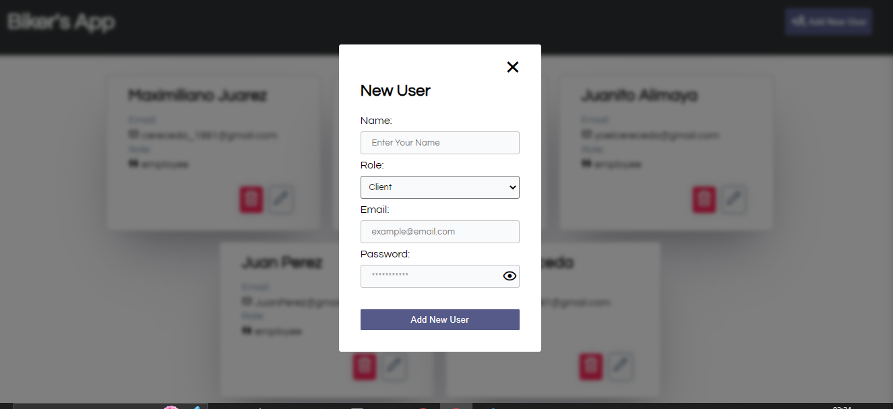
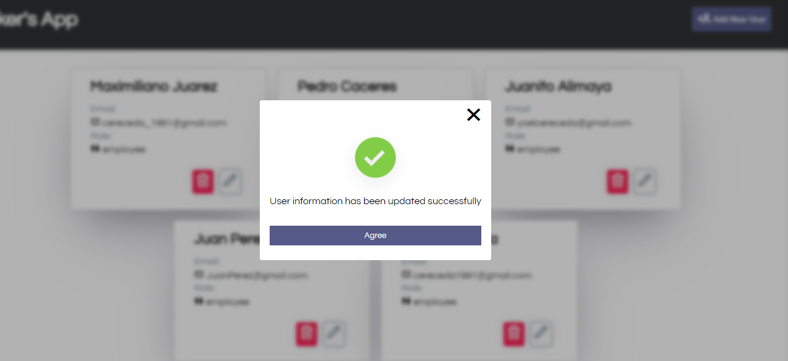

# CRUD DE USUARIOS

Este es un proyecto CRUD (Create, Read, Update, Delete) de usuarios construido con Node.js, Express, y Sequelize para el backend, y React, Vite, y Axios para el frontend.

## Capturas de pantalla

Aquí hay algunas capturas de pantalla del proyecto:

# Instalación
Para clonar y ejecutar este proyecto, necesitarás Git y Node.js (que incluye npm) instalados en tu computadora. Desde tu terminal, sigue estos pasos:

# Clona este repositorio
  git clone https://github.com/cereceda1991/BikeAppFullST.git

# Instala las dependencias del backend

  cd backend

  npm install

# Instala las dependencias del frontend

 cd frontend

 npm install

# Uso
## Inicia el servidor del backend
Desde la raíz del proyecto, puedes ejecutar el servidor del backend usando el comando:

npm run start:dev

El servidor del backend estará corriendo en el puerto 3000.

## Inicia la aplicación del frontend
Desde la carpeta frontend, puedes iniciar la aplicación del frontend usando el comando:

 npm run dev 

La aplicación del frontend estará corriendo en el puerto 5173.

## Funcionalidades

Crear un nuevo usuario

Leer la lista de usuarios

Actualizar la información de un usuario

Eliminar un usuario existente

## Contribución
Las contribuciones son bienvenidas. Si tienes sugerencias o correcciones de errores, por favor envía un mensaje a traves de mis redes sociales de mi perfil.
